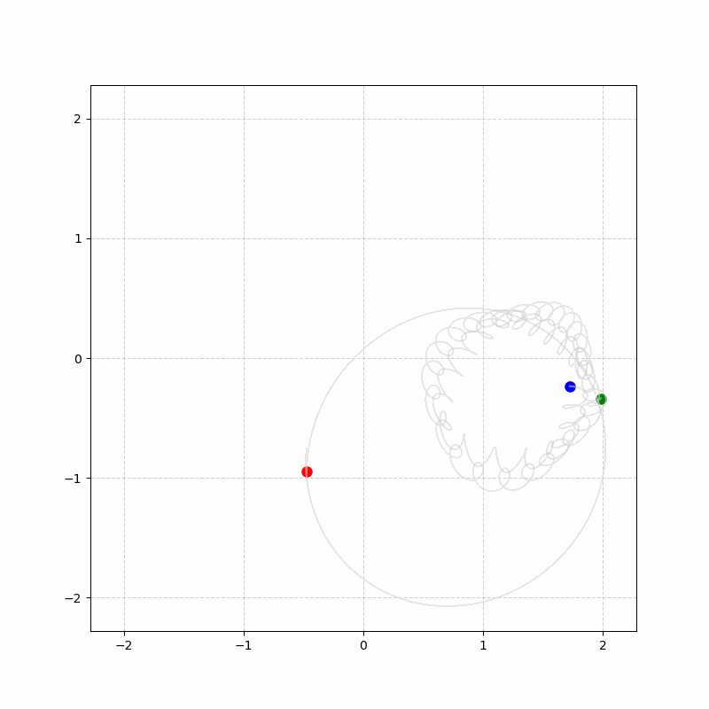
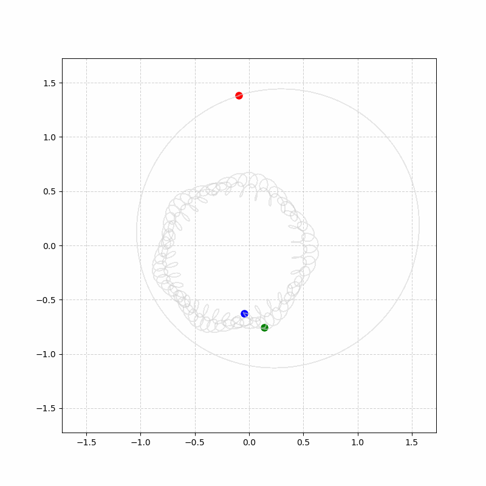
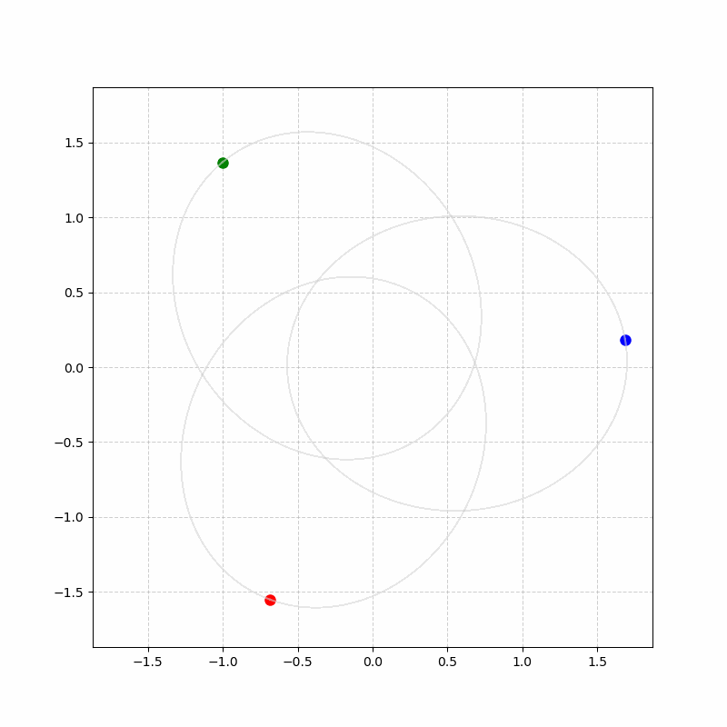
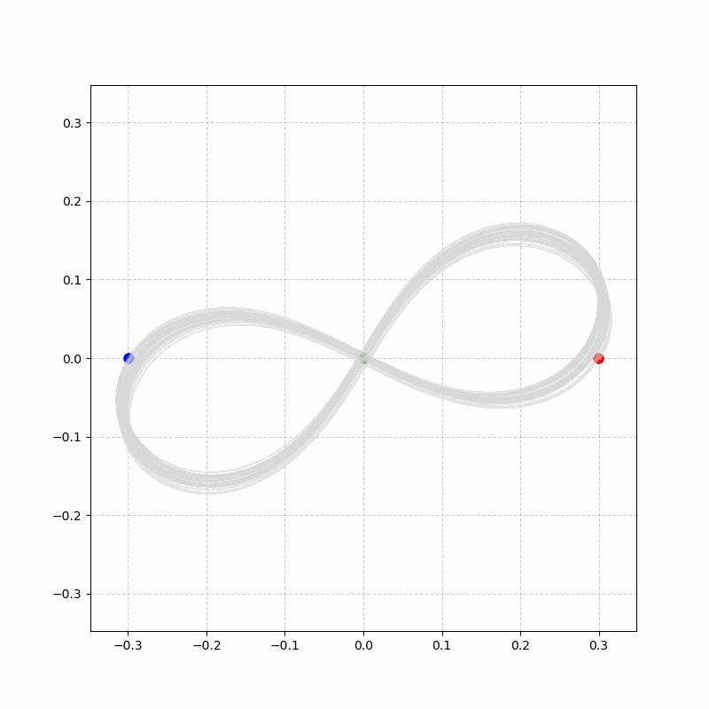

# Genetic Algorithm for Periodic Solutions in the Three-Body Problem

## Intro
I was reading Liu Cixin's The Three-Body Problem when I came accross the chapter where the character Wei Cheng talks about using the nature of random numbers to solve the three-body problem. 

>*it shows how, mathematically, random brute force can overcome precise logic ... This is my strategy for solving the three-body problem ... I treat each combination like a life form ... The computation proceeds by eliminating the disadvantaged and preserving the advantaged.*
>
>"It's an evolutionary algorithm," Wang Miao said.

Although the implication is different, it made me think about the application of Genetic Algorithm (GA) to search for periodic orbits of a three-star system.

I used GA for my thesis during my undergraduate study in mechanical engineering. Although I used it to optimize the configuration for a low-head hydroturbine to maximize efficiency, the same approach could be used.

Unsurprisingly, this approach has been done many times. However, existing research often targets a specific orbital family to understand each of the orbits better. My goal was to play and explore the use of GA with varying symmetry myself.

## The Approach
I will be using C++ due to its vectorization and parallel ability with C speed, since the computation would take millions of iteration steps. Python will be used to plot using Matplotlib. Build instructions are available [here](src/README.md).


To simplify the search space, I will constraint the system to a 2D plane and assume equal mass for all bodies. The model is structured by: 

```c++
struct Body {
    double x, y, vx, vy, ax, ay;
    double mass = 1.0;
};

struct State {
    Body b1, b2, b3;
};
```

### Gravity
We will use Newton's gravity equation to simulate the physics:

$$F = ma$$
$$\vec{F}_{ij} = G \frac{m_i m_j}{\|\vec{r}_j - \vec{r}_i\|^2} \hat{r}_{ij}$$


For a three-body system, and G is normalized for simplicity, the acceleration can be written as:

$$\vec{a}_i = \sum_{j \neq i} \frac{m_j (\vec{r}_j - \vec{r}_i)}{\|\vec{r}_j - \vec{r}_i\|^3}$$


Then, we decompose the vectors into scalars, and add a softening factor ($\epsilon$) to avoid infinite acceleration at near zero distance encounter.

$$r_{ij}^2 = (x_j - x_i)^2 + (y_j - y_i)^2 + \epsilon$$

$$r_{ij} = \sqrt{r_{ij}^2}$$

Therefore, acceleration of body $i$ caused by body $j$ is:

$$\vec{a_i} = \vec{a_i} + \left( \frac{m_j}{r_{ij}^2} \right) \left( \frac{\vec{r_j} - \vec{x_i}}{r_{ij}} \right)$$

Conversely, the acceleration of body $j$ caused by body $i$ is the opposite due to Newton's third law of motion:

$$F_{ij} = -F_{ji}$$

$$\vec{a_j} = \vec{a_j} - \left( \frac{m_j}{r_{ij}^2} \right) \left( \frac{\vec{r_j} - \vec{x_i}}{r_{ij}} \right)$$

```c++
void derivs(State& s) {
    const double epsilon = 0.0001;

    // body 1 and body 2
    double dx12 = s.b2.x - s.b1.x;
    double dy12 = s.b2.y - s.b1.y;
    double r2_12 = (dx12 * dx12) + (dy12 * dy12) + epsilon;
    double r_12 = std::sqrt(r2_12);

    s.b1.ax += (s.b2.mass / r2_12) * (dx12 / r_12);
    s.b1.ay += (s.b2.mass / r2_12) * (dy12 / r_12);

    s.b2.ax -= (s.b1.mass / r2_12) * (dx12 / r_12);
    s.b2.ay -= (s.b1.mass / r2_12) * (dy12 / r_12);

    // same goes for the rest ..
}
```


### Numerical Method
When it comes to simulating orbits, we need a numerical solver that can preserve the Hamiltonian for a long period of time. The Velocity Verlet is a perfect choice for this as it is a symplectic integrator, which means it preserved energy for long-term stability.

$$\vec{r}(t + \Delta t) = \vec{r}(t) + \vec{v}(t)\Delta t + \frac{1}{2}\vec{a}(t)\Delta t^2$$
$$\vec{v}(t + \frac{1}{2}\Delta t) = \vec{v}(t) + \frac{1}{2}\vec{a}(t)\Delta t$$
$$\vec{a}(t + \Delta t) = \vec{A}(\vec{r}_1, \vec{r}_2, \vec{r}_3)$$
$$\vec{v}(t + \Delta t) = \vec{v}(t + \frac{1}{2}\Delta t) + \frac{1}{2}\vec{a}(t + \Delta t)\Delta t$$

Since the fourth step to calculate the velocity requires the half-step of the velocity (which is the second step of the integration), we simply merge them, so we get:

$$\vec{r} = \vec{r} + \vec{v}\Delta t + \frac{1}{2}\vec{a_{old}}\Delta t^2$$

$$\vec{a_{new}} = \vec{A}(\vec{r}_1, \vec{r}_2, \vec{r}_3)$$

$$\vec{v} = \vec{v} + \frac{1}{2}(\vec{a_{old}} + \vec{a_{new}}) \Delta t$$

```c++
void verlet(State& s, double T, double dt){
    // Solve position (full-step)
    s.b1.x += s.b1.vx * dt + 0.5 * s.b1.ax * dt * dt;
    s.b1.y += s.b1.vy * dt + 0.5 * s.b1.ay * dt * dt;
    s.b2.x += s.b2.vx * dt + 0.5 * s.b2.ax * dt * dt;
    s.b2.y += s.b2.vy * dt + 0.5 * s.b2.ay * dt * dt;
    s.b3.x += s.b3.vx * dt + 0.5 * s.b3.ax * dt * dt;
    s.b3.y += s.b3.vy * dt + 0.5 * s.b3.ay * dt * dt;

    // Save old acceleration
    State old = s;

    // Derive new acceleration
    derivs(s);
        
    // Solve velocity
    s.b1.vx += 0.5 * (old.b1.ax + s.b1.ax) * dt;
    s.b1.vy += 0.5 * (old.b1.ax + s.b1.ay) * dt;
    s.b2.vx += 0.5 * (old.b1.ax + s.b2.ax) * dt;
    s.b2.vy += 0.5 * (old.b1.ax + s.b2.ay) * dt;
    s.b3.vx += 0.5 * (old.b1.ax + s.b3.ax) * dt;
    s.b3.vy += 0.5 * (old.b1.ax + s.b3.ay) * dt;
}
```

### Genetic Algorithm
I will be using a pre-made library [GALGO 2.0](https://github.com/olmallet81/GALGO-2.0) by *Olivier Mallet* to handle the GA. It is a simple yet powerful GA library with available parallelization using OpenMP.

For simplicity, the default GA configuration from the library would be used except for the mutation rate, which I would vary between $0.5$-$20$%. Population size is $500$, and the number of generations is $5000$ to give more time for the search.

```c++
#include "Galgo.hpp"

template <typename T>
class ThreeBody {
public:
    static std::vector<T> Objective(const std::vector<T>& x) {
        State s;

        // Constraint here ...

        State initial = s;

        verlet(s, 10, 0.001); // integration
        double error = fitness(initial, s); // fitness calculation
        return {error};
}
};

int main() {

    // parameters here (based on constraint) ..

    galgo::GeneticAlgorithm<double> ga(ThreeBody<double>::Objective, 500, 5000, true, 
                                    // parameters here ..);
    
    ga.mutrate = 0.2;
    ga.run();

    return 0;
```

### Fitness Function
The algorithm will start by generating a bunch of random initial conditions for each generation based on the population number. For each individual, the physics simulator will be computed to calculate its orbit. After a certain time period ($T$), the fitness function will calculate the Euclidian distance given by:
$$d = \sqrt{\sum_{i=1}^{3} (x_T - x_0)^2 + (y_T - y_0)^2}\$$
to calculate how much it deviates away from the origin. This way the GA will look for initial conditions of a three-body system where each bodies return to its initial position after the given time period.

```c++
inline double euclidian(const State& initial, const State& final) {
    double d1 = std::pow(final.b1.x - initial.b1.x, 2) + std::pow(final.b1.y - initial.b1.y, 2);
    double d2 = std::pow(final.b2.x - initial.b2.x, 2) + std::pow(final.b2.y - initial.b2.y, 2);
    double d3 = std::pow(final.b3.x - initial.b3.x, 2) + std::pow(final.b3.y - initial.b3.y, 2);
    
    return std::sqrt(d1 + d2 + d3);
```

This alone has a problem, a body can get ejected out of orbit and be at the position of $\vec{r_0} = \vec{r_T}$, and the GA will think it is a stable orbit. To avoid that, we give a maximum value ($R_{max}$) of the euclidian distance allowed:
$$\max(|\vec{r}_1(T)|, |\vec{r}2(T)|, |\vec{r}3(T)|) ≯  R_{max} $$

Finally, we have to make sure that the GA doesn't just make the bodies orbit each other at an extremely close distance. We give a minimum value ($R_{min}$) of how close are the permitted distance between each bodies: 
$$d_{12}, d_{13}, d_{23} ≮  R_{min} $$

The error we return should be negative since the GA library we use maximizes by default: 

```c++
inline double fitness(const State& initial, const State& final) {
    // ejection Check
    double max_dist = std::max({
        std::sqrt(final.b1.x*final.b1.x + final.b1.y*final.b1.y),
        std::sqrt(final.b2.x*final.b2.x + final.b2.y*final.b2.y),
        std::sqrt(final.b3.x*final.b3.x + final.b3.y*final.b3.y)
    });
    if (max_dist > 4.0) return -9999.0;

    // proximity Check
    double d12 = std::sqrt(std::pow(final.b2.x - final.b1.x, 2) + std::pow(final.b2.y - final.b1.y, 2));
    double d13 = std::sqrt(std::pow(final.b3.x - final.b1.x, 2) + std::pow(final.b3.y - final.b1.y, 2));
    double d23 = std::sqrt(std::pow(final.b3.x - final.b2.x, 2) + std::pow(final.b3.y - final.b2.y, 2));
    if (d12 < 0.2 || d13 < 0.2 || d23 < 0.2) return -8888.0;

    double error = euclidian(initial, final);

    // NaN / Inf check
    if (std::isnan(error) || std::isinf(error)) return -7777.0;

    return -error; 
}
```

## Results
### Unconstrained Search
First, let's run the GA without any constraint, meaning the GA have 12 degree of freedom for all three bodies starting position and velocity. 

```c++
s.b1.x = x[0]; s.b1.y = x[1];
s.b1.vx = x[2]; s.b1.vy = x[3];

s.b2.x = x[4]; s.b2.y = x[5];
s.b2.vx = x[6]; s.b2.vy = x[7];

s.b3.x = x[8]; s.b3.y = x[9];
s.b3.vx = x[10]; s.b3.vy = x[11];
```

```
 Running Genetic Algorithm...
 ----------------------------
 Generation =    0 | X1 =   0.27219 | X2 =   0.46226 | X3 =   0.41640 | X4 =   0.22618 | X5 =  -1.13457 | X6 =  -0.20938 | X7 =  -0.44057 | X8 =  -0.64181 | X9 =  -0.31339 | X10 =  -0.67344 | X11 =  -0.19136 | X12 =   0.24514 | F(x) =     -2.28541
 
 ...

 Generation = 5000 | X1 =  -0.47306 | X2 =  -0.94975 | X3 =   0.00591 | X4 =   0.65853 | X5 =   1.72198 | X6 =  -0.23465 | X7 =   0.99457 | X8 =  -0.03362 | X9 =   1.98297 | X10 =  -0.33689 | X11 =  -0.99750 | X12 =  -0.59973 | F(x) =     -0.29280

```
It converged to -0.29280 error distance to the initial position, which is quite high.

The result is a rough drifting hierarchiecal system.



Notice that the initial line does not merge with the final line, and is guaranteed to drift if we simulate any further. However, it is satisfying to see that without no constraint, a truly random search gives out the most efficient orbit on which most three-star system are organized in.

### Barycentric Reduction
Most three-star system are organized in a hierarcial system due to its nature to preserve momentum and the center of mass. Let's look at it further by applying a barycentric reduction and defining constraint for the GA to the system's center of mass:

$$\frac{m_1\vec{r_1} + m_2\vec{r_2} + m_3\vec{r_3}}{\vec{r_1}+\vec{r_2}+\vec{r_3}} = 0$$

since all bodies have the same mass,

$$\vec{r_1} + \vec{r_2} + \vec{r_3} = 0$$

$$\vec{r_3} = -(\vec{r_1} + \vec{r_2})$$

Then, we conserve the momentum:

$$m_1\vec{v_1} + m_2\vec{v_2} + m_3\vec{v_3} = 0$$

$$\vec{v_1} + \vec{v_2} + \vec{v_3} = 0$$

$$\vec{v_3} = -(\vec{v_1} + \vec{v_2})$$

By constraining $r_3$ and $v_3$, we reduce the GA degree of freedom to 8.

```c++
s.b1.x = x[0]; s.b1.y = x[1];
s.b1.vx = x[2]; s.b1.vy = x[3];

s.b2.x = x[4]; s.b2.y = x[5];
s.b2.vx = x[6]; s.b2.vy = x[7];

s.b3.x = -(s.b1.x + s.b2.x);
s.b3.y = -(s.b1.y + s.b2.y);
s.b3.vx = -(s.b1.vx + s.b2.vx);
s.b3.vy = -(s.b1.vy + s.b2.vy);
```

```
 Running Genetic Algorithm...
 ----------------------------
 Generation =    0 | X1 =   0.22928 | X2 =  -0.66313 | X3 =   0.19716 | X4 =  -0.72244 | X5 =   0.29795 | X6 =   1.35009 | X7 =  -0.71725 | X8 =   0.27788 | F(x) =     -0.53168

 ...
 
 Generation = 5000 | X1 =  -0.09531 | X2 =   1.38268 | X3 =   0.74383 | X4 =   0.22881 | X5 =  -0.04538 | X6 =  -0.62516 | X7 =   0.44741 | X8 =   0.17897 | F(x) =     -0.01358

```

The result is a smooth hierarcial star system with a converged -0.01358 error in distance.



### Rotational Symmetry
Most three-star systems aren't symmetric. If we want to search for a symmetric orbit, we have to put a constraint that mirrors the orbit at $t=0$. We do this by constraining the GA to only look for one body's position and velocity, and the other two followed its configuration at a different angle.

Here, I have the GA only configure one body, and have the other gets the same configuration but rotated along the initial position axis. One body would get rotated 120° and the other 240°:

$$\theta_2 = \frac{2\pi}{3}, \quad \theta_3 = \frac{4\pi}{3}$$

$$x_2 = x_1 \cos(\theta_2) - y_1 \sin(\theta_2), \quad y_2 = x_1 \sin(\theta_2) + y_1 \cos(\theta_2)$$

$$v_{x2} = v_{x1} \cos(\theta_2) - v_{y1} \sin(\theta_2), \quad v_{y2} = v_{x1} \sin(\theta_2) + v_{y1} \cos(\theta_2)$$

$$x_3 = x_1 \cos(\theta_3) - y_1 \sin(\theta_3), \quad y_3 = x_1 \sin(\theta_3) + y_1 \cos(\theta_3)$$

$$vx_3 = v_{x1} \cos(\theta_3) - v_{y1} \sin(\theta_3), \quad v_{y3} = v_{x1} \sin(\theta_3) + v_{y1} \cos(\theta_3)$$

This would reduce the GA degree of freedom to only 4, which are only one body's initial state.

```c++
const double PI = std::acos(-1.0);
const double a120 = 2.0 * PI / 3.0;
const double a240 = 4.0 * PI / 3.0;

s.b1.x = x[0]; s.b1.y = x[1];
s.b1.vx = x[2]; s.b1.vy = x[3];

// rotate b1 by 120°
s.b2.x  = s.b1.x * cos(a120) - s.b1.y * sin(a120);
s.b2.y  = s.b1.x * sin(a120) + s.b1.y * cos(a120);
s.b2.vx = s.b1.vx * cos(a120) - s.b1.vy * sin(a120);
s.b2.vy = s.b1.vx * sin(a120) + s.b1.vy * cos(a120);

// rotate b1 by 240°
s.b3.x  = s.b1.x * cos(a240) - s.b1.y * sin(a240);
s.b3.y  = s.b1.x * sin(a240) + s.b1.y * cos(a240);
s.b3.vx = s.b1.vx * cos(a240) - s.b1.vy * sin(a240);
s.b3.vy = s.b1.vx * sin(a240) + s.b1.vy * cos(a240);
```

```
 Running Genetic Algorithm...
 ----------------------------
 Generation =    0 | X1 =  -1.76001 | X2 =   0.39658 | X3 =  -0.13622 | X4 =   0.33812 | F(x) =     -0.03077

 ...
 
 Generation = 5000 | X1 =  -0.68315 | X2 =  -1.55273 | X3 =  -0.38961 | X4 =   0.14220 | F(x) =     -0.00011

```

The result is a beautifully converged -0.00011 error in distance.   


The GA balance the centrifugal force againts gravity. The surviving orbits are perfect, periodic rings. 

### Collinear Symmetry
If we took this symmetric constraint further, we can enforce a collinear configuration at $t=0$. In this configuration, the y coordinates of all bodies are set in one line.

$$y_1 = y_2 = y_3 = 0$$

Then, we mirror one body with the other, with the same velocity:

$$x_1 = -x_2$$
$$\vec{v_1} = \vec{v_2}$$

Finally, the third body should be in the center, while balancing the momentum from the other bodies:

$$x_3 = 0$$
$$\vec{v_3} = -(\vec{v_1} + \vec{v_2})$$

By doing this, we reduce the degree of freedom to 3. That is the position($x$) and velocity($x,y$) for only one body.

```c++
s.b1.x = x[0];  
s.b1.y = 0.0;
s.b1.vx = x[1];
s.b1.vy = x[2];

s.b2.x = -s.b1.x;
s.b2.y = 0.0;
s.b2.vx = s.b1.vx;
s.b2.vy = s.b1.vy;

s.b3.x = 0.0;      
s.b3.y = 0.0;
s.b3.vx = -2.0 * s.b1.vx; 
s.b3.vy = -2.0 * s.b1.vy;
```

```
 Running Genetic Algorithm...
 ----------------------------
 Generation =    0 | X1 =  -0.41715 | X2 =  -0.57896 | X3 =   0.89772 | F(x) =     -1.22002
 Generation =   10 | X1 =   0.37101 | X2 =   0.36820 | X3 =   0.83992 | F(x) =     -0.14973
 ...
 Generation = 4990 | X1 =   0.29258 | X2 =  -0.63359 | X3 =   0.98799 | F(x) =     -0.00636
 Generation = 5000 | X1 =   0.29258 | X2 =  -0.63359 | X3 =   0.98799 | F(x) =     -0.00636
```

And we get the famous figure-eight orbit for the three-body problem discovered by *Cristopher Moore* in 1993!


## Final Note
These are only some examples of how GA can be used to optimized constrained system within the three-body problem. Current method to search for periodic families of orbits used more advanced methods such as topological tools with high-performance computing. However, the fact that giving constraints to random searches can lead to beautiful symmetries and replicate previously known orbits is astonishing. This exploration using an evolutionary algorithm shows how random numbers can lead us to finding order in chaos.  
